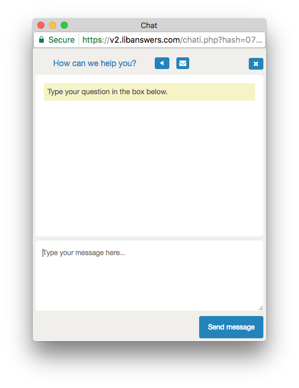

# University of Arizona Libraries LibChat Customizations

[](https://travis-ci.org/ualibraries/ual-libchat)
[](https://david-dm.org/ualibraries/ual-libchat)



## Getting started

Install the dependencies: `npm install`

Build the project with `npm run build`

## Deploying

The contents of the `css` directory are served from an Amazon S3 bucket named `ualibr-libchat`.

You can deploy the project by running `npm run deploy`. You might need to specify an AWS profile
like this: `npm run deploy -- --profile=profilename`.

## LibChat settings

Paste the following into the 'Custom CSS' field on the 'LibChat Widget Creator' page:

```css
@import url("http://ualibr-libchat.s3-website-us-west-2.amazonaws.com/ual-libchat.css");
```

## Local testing

Running `npm run watch` will:

* Start a local static webserver.
You will the be provided with a css import at-rule to paste into LibChat widget creator.
* Watch CSS files and process them when they change

## Learn more

* [PostCSS](http://postcss.org/) and [PostCSS-cssnext](http://cssnext.io/)
* [Travis CI](https://travis-ci.org/)
* [Mocha](http://mochajs.org/)
* [Chai](http://chaijs.com/)
